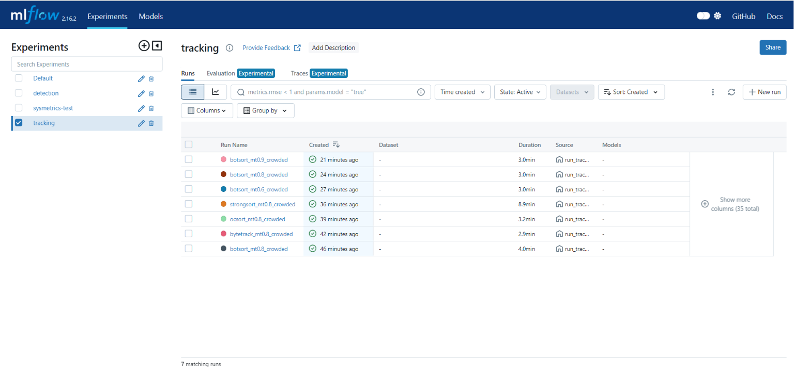
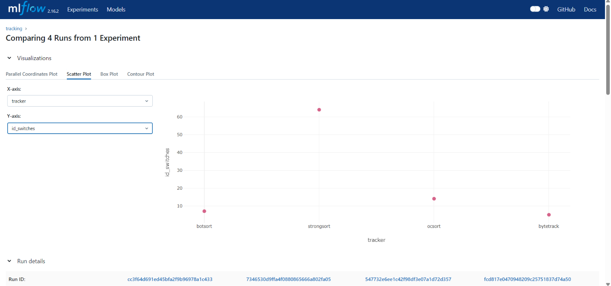
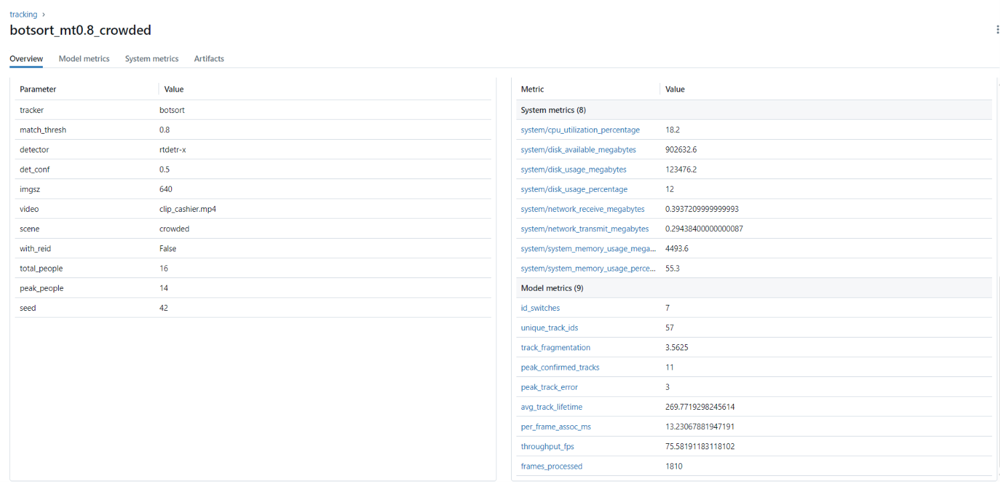
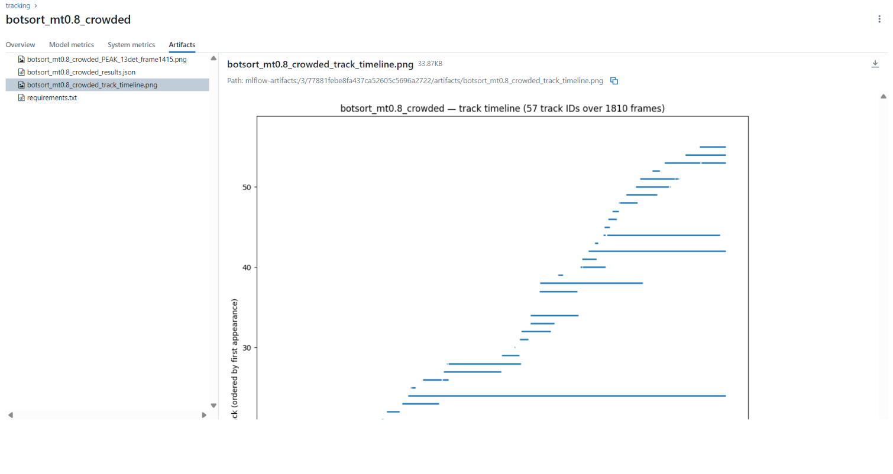
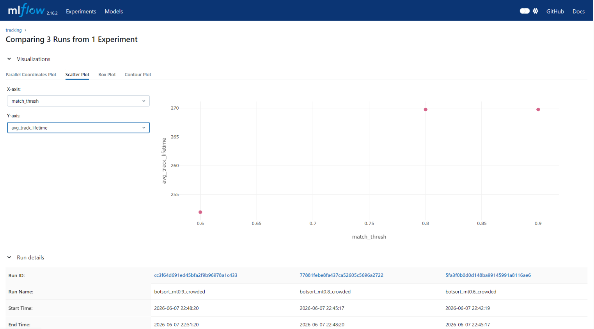
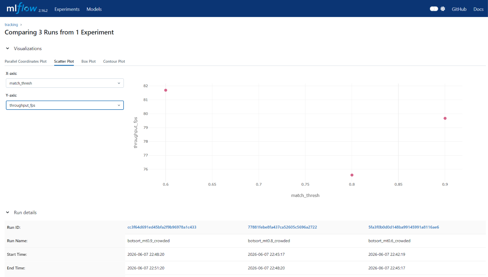

# Tracking Experiment — MLflow Screenshots

Visual evidence of the tracking experiment in MLflow (7 runs: 4-tracker comparison
+ BoT-SORT match_thresh sweep, on the crowded clip, detection fixed at
rtdetr-x conf0.5). Static captures; the live setup is reproducible — see
[`MLFLOW_GUIDE.md`](MLFLOW_GUIDE.md) and the numeric analysis in
`docs_models/tracking/TRACKING_RESULTS.md` (generated after the runs).

> To regenerate live: `docker compose -f docker-compose.yml -f docker-compose.dev.yml up -d postgres minio mlflow` → open http://localhost:5000 → experiment **tracking**.

---

## 1. Runs table — all 7 tracking runs

The `tracking` experiment with all 7 runs: comparison (botsort / bytetrack / ocsort /
strongsort) + BoT-SORT match_thresh sweep (0.6 / 0.8 / 0.9). Detection is held
constant (rtdetr-x conf0.5) so differences are purely the tracker.

## 2. Tracker comparison (Compare view — id_switches by tracker)

MLflow Compare (scatter) of the 4 trackers. With `id_switches` on the Y-axis,
**StrongSORT is the clear outlier (64 switches)** while BoT-SORT / OC-SORT / ByteTrack
sit low — the comparison that eliminates StrongSORT and frames the BoT-SORT decision.
(Switch the Y-axis to `unique_track_ids` to see BoT-SORT's win on the primary churn
metric: 57 vs 65 / 82 / 83.)

## 3. Best tracker — metrics

The chosen tracker's run with its full metric set (Tier 1 quality + Tier 2 support +
Tier 3 performance). Note `id_switches`, `unique_track_ids`, `avg_track_lifetime`,
and `per_frame_assoc_ms` / `throughput_fps`.

## 4. Track-timeline (Gantt) artifact — the key tracking visual

Per-track timeline: each track ID is a horizontal bar over the frames it was alive.
A stable tracker shows few long bars; a churny tracker shows many short/fragmented
bars. This visualizes *why* `unique_track_ids` / fragmentation differ between
trackers — far more informative than a still frame.

## 5. match_thresh sweep — tuning effect

BoT-SORT at match_thresh 0.6 / 0.8 / 0.9 compared. Shows whether the threshold
meaningfully changes tracking quality on this clip (your docs found it flat — if so,
note `result=no_effect`).

## 6. Performance comparison — speed across trackers

`per_frame_assoc_ms` / `throughput_fps` across the 4 trackers — the "which is
faster" view. Motion-only trackers (BoT-SORT/ByteTrack/OC-SORT) vs the
appearance-based StrongSORT.

---

## Decision

**Winning tracker: BoT-SORT @ match_thresh 0.8** — lowest identity churn
(`unique_track_ids` 57, `track_fragmentation` 3.56) with low `id_switches` (7).
StrongSORT eliminated (64 switches, ~20× slower); ByteTrack/OC-SORT are far faster but
churn more identities. Full numeric analysis + the speed trade-off:
[`docs_models/tracking/TRACKING_RESULTS.md`](docs_models/tracking/TRACKING_RESULTS.md).

The **track-timeline (#4)** is the signature tracking artifact — it visualizes the churn
behind `unique_track_ids` directly (few long bars = stable; many short bars = churny).
