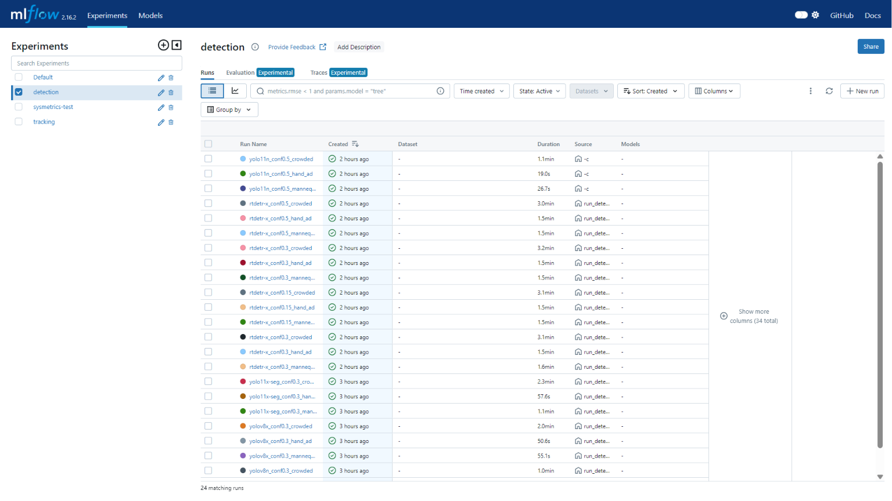
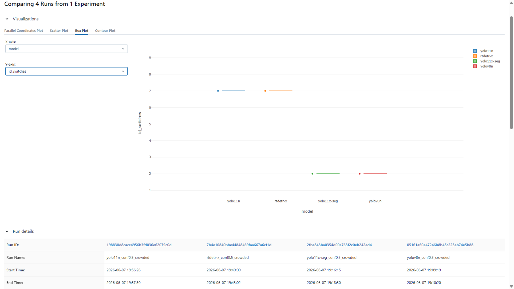
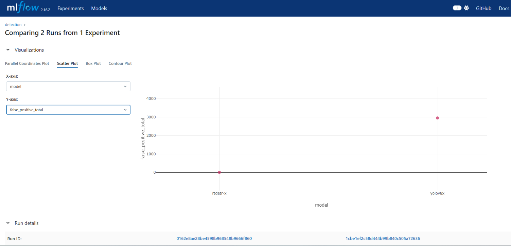
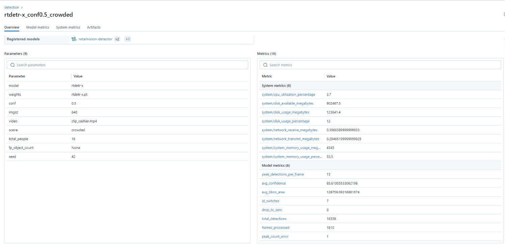
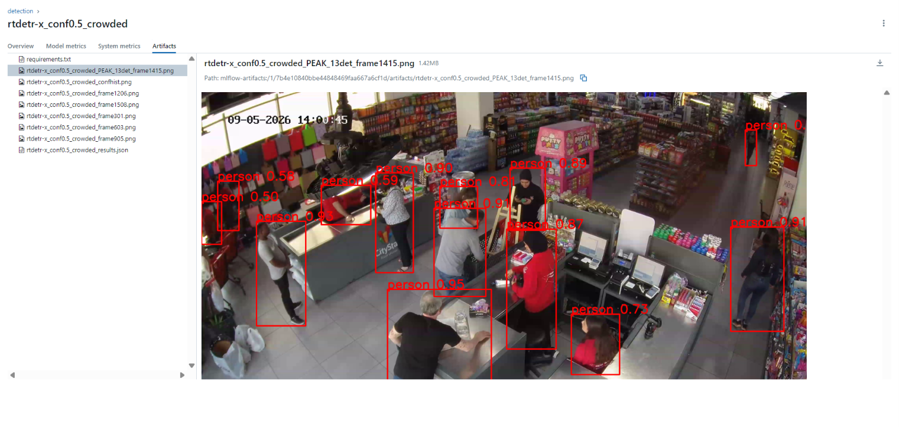
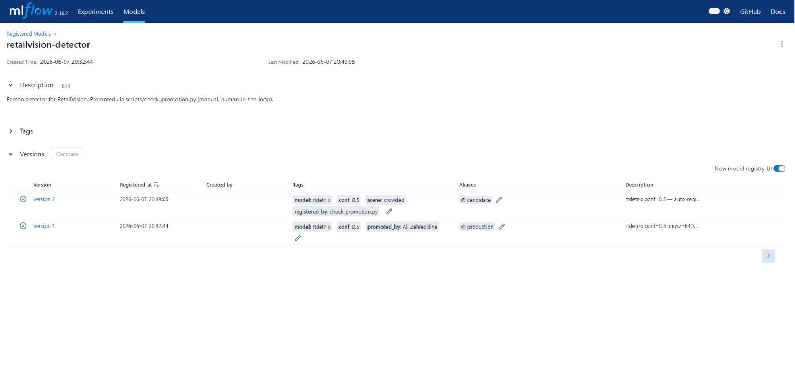

# Detection Experiment — MLflow Results & Model Decision

> Auto-generated from the MLflow `detection` experiment (24 runs, GPU/RTX 3070).
> Source of truth = the MLflow tracking server (run `docker compose ... up -d mlflow`
> → http://localhost:5000 → experiment `detection`). Promoted run id:
> `7b4e10840bbe44848469faa667a6cf1d` (rtdetr-x, conf=0.5, crowded).
>
> **Metric set (cleaned):** detection metrics — `avg_confidence`, `avg_bbox_area`,
> `peak_detections_per_frame`, `total_detections`, `false_positive_total` /
> `false_positive_per_frame` (0-people clips), `peak_count_error` (crowded). Tracker
> context kept: `id_switches`, `drop_to_zero`. The broken `unique_tracks` /
> `count_error` (cumulative track IDs vs people — measured tracking fragmentation,
> not detection) were dropped.

## Experiment design

- **Models (comparison, conf=0.3):** yolov8n (weak baseline), yolov8x (strong CNN),
  yolo11x-seg (segmentation), rtdetr-x (transformer).
- **Extra (conf=0.5):** yolo11n (nano YOLOv11, second lightweight baseline).
- **Tuning (rtdetr-x):** conf ∈ {0.15, 0.30, 0.50}.
- **Run = (model × scene)** — every config runs on all three clips.
- **Scenes / ground truth:**
  - `mannequin` (clip_mannequin.mp4) — 0 people, 8 mannequins → every detection = FP.
  - `hand_ad` (hand_on_ad_in_store.mp4) — 0 people, 1 printed hand → every detection = FP.
  - `crowded` (clip_cashier.mp4, 3072×2048) — 16 people, peak 14 → count accuracy.

**All 24 runs in MLflow:**



---

## 1. Crowded scene (clip_cashier — 16 people, peak 14)

The people-detection benchmark. `peak_count_error = |peak_detections_per_frame − 14|`
(lower = better). `avg_confidence` higher = better. `id_switches` is tracker churn.

| Model | conf | avg_conf % | avg_bbox_area | peak_det/frame | **peak_count_error** | id_switches |
|---|---|---|---|---|---|---|
| yolo11n | 0.5 | 73.2 | 158,897 | 11 | 3 | 7 |
| yolov8n | 0.3 | 65.1 | 140,009 | 12 | 2 | 2 |
| yolov8x | 0.3 | 76.7 | 125,919 | 15 | 1 | 3 |
| yolo11x-seg | 0.3 | 76.5 | 132,154 | 13 | 1 | 2 |
| rtdetr-x | 0.3 | 78.5 | 117,659 | 18 | 4 | **1** |
| rtdetr-x | 0.15 | 57.0 | 86,696 | 32 | 18 | 1 |
| **rtdetr-x** | **0.5** | **85.6** | 128,759 | **13** | **1** | 7 |

**Reading it:**
- **rtdetr-x @ conf=0.5 is the best detector on real people:** highest confidence
  (85.6%), peak detections 13 vs true 14 (`peak_count_error=1`).
- **conf is decisive for rtdetr-x:** 0.15 over-detects badly (peak 32, error 18 — noise),
  0.3 over-detects (peak 18, error 4 — duplicate boxes), 0.5 lands on 13. Confirms the
  bimodal-confidence behaviour from `detection_experiments.md` Round 6.
- **conf trade-off:** 0.5 wins on count/confidence; 0.3 wins on tracking stability
  (id_switches 1 vs 7). Production choice = **0.5** (raw peak accuracy + confidence);
  the extra ID switches are a tracking-stage concern handled downstream.
- yolov8x and yolo11x-seg are close behind (peak_count_error=1) but lower confidence.
- yolov8n (weak baseline) under-detects (peak 12) and is least confident — as expected.

> **Caveat (honest):** raw detection over-counts in crowds because RT-DETR is NMS-free
> and the harness counts every box (no IoU dedup — by design). True per-person counts
> come after ReID de-duplication in IEP3, not the detection stage. So treat
> peak_count_error as a *detection-stage proxy*, not the final occupancy number.

**MLflow Compare — model metrics on the crowded scene:**



---

## 2. Mannequin scene (clip_mannequin — 0 people, 8 mannequins)

Every detection is a false positive. `false_positive_total` lower = better (0 = perfect
3-D mannequin rejection).

| Model | conf | **false_positive_total** | avg_conf % | verdict |
|---|---|---|---|---|
| **rtdetr-x** | **0.3 / 0.5** | **0** | 0.0 (nothing detected) | ✅ structural rejection |
| **yolo11n** | **0.5** | **0** | 0.0 (nothing detected) | ⚠️ rejects, but by weakness (see note) |
| rtdetr-x | 0.15 | 1,333 | 18.1 | low-conf leakage |
| yolov8n | 0.3 | 1,686 | 41.8 | fails |
| yolov8x | 0.3 | 2,953 | 51.1 | fails worse |
| yolo11x-seg | 0.3 | 4,506 | 45.4 | fails worst |

**Reading it:** RT-DETR @ conf ≥ 0.3 detects **zero** mannequins — a clean, decisive win
and the single strongest result in the experiment. Every full-size CNN/seg model fires
thousands of false positives. This is RT-DETR's structural advantage (global attention
rejects static, motion-less figures). At conf=0.15 even RT-DETR leaks (1,333),
reinforcing that 0.3+ is the right operating point.

> **yolo11n @ conf0.5 also scores 0 — but for the wrong reason.** The nano model at a
> high threshold is simply too conservative to fire on hard cases. Its 0-FP is a side
> effect of **low sensitivity**, not robust discrimination — the same weakness that
> makes it under-detect real people (peak 11 vs 14, fails the gate). RT-DETR rejects
> mannequins *while still detecting people well*; yolo11n rejects them by detecting
> less of everything. Not equivalent.

**Mannequin FP comparison across all models:**



---

## 3. Hand-ad scene (hand_on_ad_in_store — 0 people, 1 printed hand)

The failure mode RT-DETR does **not** solve (a 2-D printed human — `detection_experiments.md`
Case 3). Every detection is a FP.

| Model | conf | **false_positive_total** | note |
|---|---|---|---|
| yolov8n | 0.3 | **0** | too weak to fire on the printed hand |
| yolo11n | 0.5 | **0** | too weak to fire (nano @ high conf) |
| yolov8x | 0.3 | 532 | detects the hand |
| yolo11x-seg | 0.3 | 532 | detects the hand |
| rtdetr-x | 0.3 / 0.5 | 532 | **detects the hand (Case 3 — unsolved)** |
| rtdetr-x | 0.15 | 537 | slightly more |

**Reading it:** RT-DETR rejects 3-D mannequins but consistently detects the 2-D printed
hand (532 FPs across all confs). The two "0" rows (yolov8n, yolo11n) are **not a virtue**
— both are weak/conservative configs too insensitive to fire, the same weakness that
makes them miss real people. This is an honest, documented limitation, not a bug: 2-D
printed humans need a separate mitigation (static-object suppression / zone masking),
out of scope for the detector.

---

## 4. Cross-scene ranking & decision

| Dimension | Winner | Evidence |
|---|---|---|
| Real-people detection (crowded) | **rtdetr-x @ conf 0.5** | conf 85.6%, peak_count_error 1 |
| Mannequin rejection | **rtdetr-x @ conf ≥0.3** | 0 FP vs 1.7k–4.5k for others |
| Hand-ad rejection | none (all detect it) | rtdetr-x = 532 (known limitation) |
| Tracking stability (id_switches) | rtdetr-x @ conf 0.3 | 1 (vs 7 at conf 0.5) |
| Confidence | rtdetr-x @ conf 0.5 | 85.6% (highest overall) |

### Decision: **rtdetr-x, conf=0.5, imgsz=640** ✅

Chosen because it is the only model that simultaneously (a) detects real people
accurately (peak 13≈14, highest confidence), and (b) perfectly rejects 3-D mannequins
(0 FP). conf=0.5 over conf=0.3: cleaner raw peak (13 vs 18 — fewer duplicate boxes) and
higher confidence; accepted trade-off is more ID switches (7 vs 1), a tracking-stage
concern, not a detection one.

**Promotion gate result** (`scripts/check_promotion.py` on run `7b4e10840bbe44848469faa667a6cf1d`):
`avg_confidence` 85.6 ≥ 75 ✅ · `id_switches` 7 ≤ 12 ✅ · `peak_count_error` 1 ≤ 2 ✅ →
**PROMOTE**. (Mannequin run: 0 FP ✅. Hand-ad run: 532 FP → correctly DO NOT PROMOTE on
that scene, the documented Case-3 limitation.)

**Winner run metrics in MLflow:**



**Peak-count frame — busiest frame in clip_cashier (13 detections, true peak 14):**



**Detection model registered as Production in MLflow Model Registry:**



### Known limitations (state in the report)
1. **2-D printed humans** (hand-ad) are not rejected — needs static-object suppression.
2. **Crowd counts are raw** (no NMS/IoU dedup) — over-read; true occupancy is computed
   after ReID dedup in IEP3.
3. **conf trade-off** between count accuracy (0.5) and tracking stability (0.3) is real;
   0.5 chosen for the detection gate, revisit if downstream tracking churn matters.

---

## 5. How to reproduce / view

```bash
docker compose -f docker-compose.yml -f docker-compose.dev.yml up -d postgres minio mlflow
# open http://localhost:5000 -> experiment "detection"

# re-run the full 21 on GPU:
docker compose -f docker-compose.yml -f docker-compose.dev.yml -f docker-compose.gpu.yml \
  --profile mlops run --rm mlops python mlops/eval/run_detection_eval.py

# check promotion for the chosen model:
python scripts/check_promotion.py --run-id 7b4e10840bbe44848469faa667a6cf1d
```

Artifacts per run (in MLflow + `mlops/outputs/`): confidence histogram, 5 annotated
sample frames, the **peak-count frame** (busiest frame, named `*_PEAK_<n>det_*`),
`results.json`, `requirements.txt`. System metrics (CPU/RAM) on runs > ~2 s.
