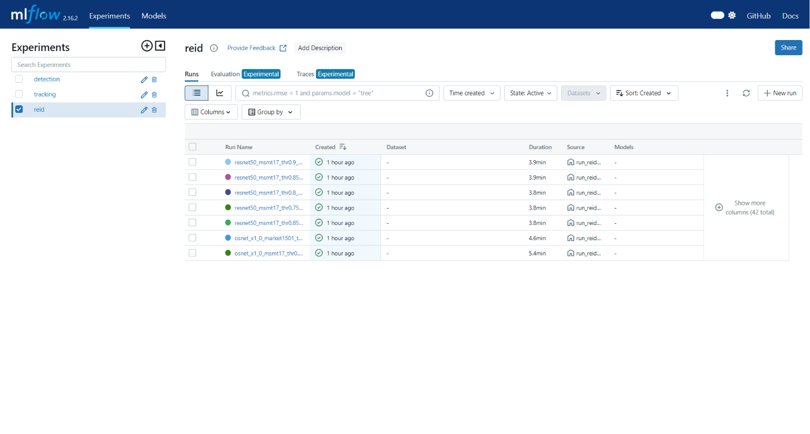
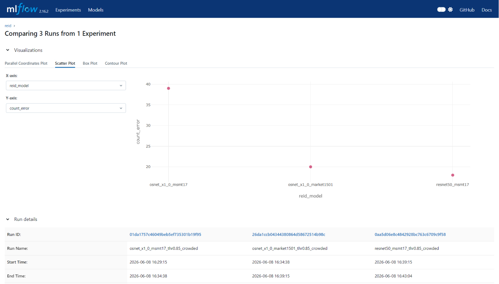
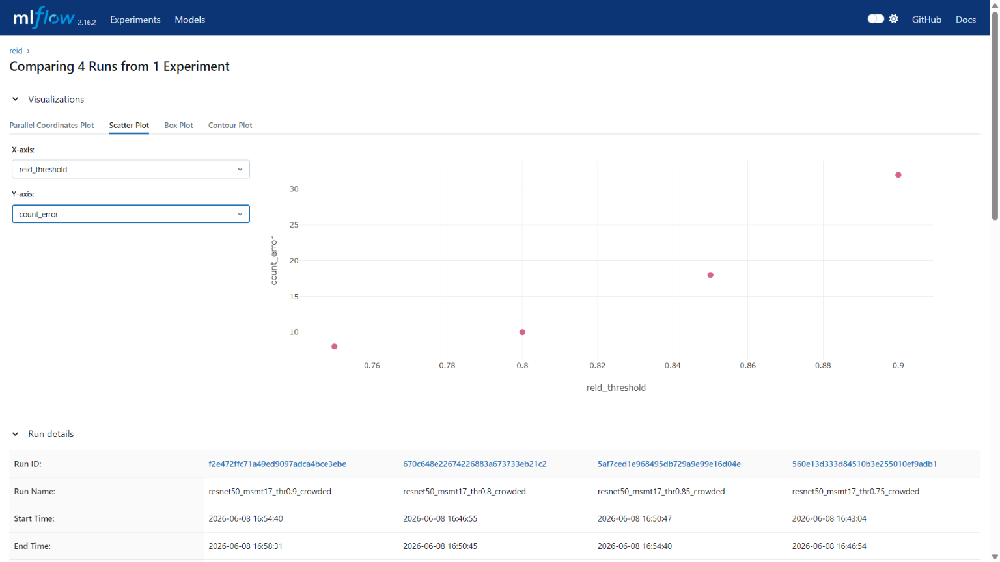
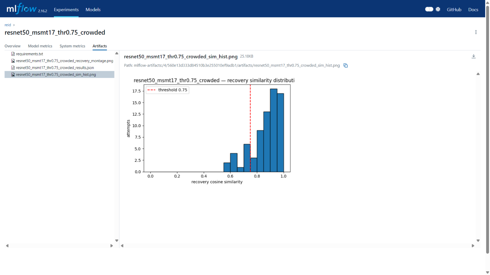
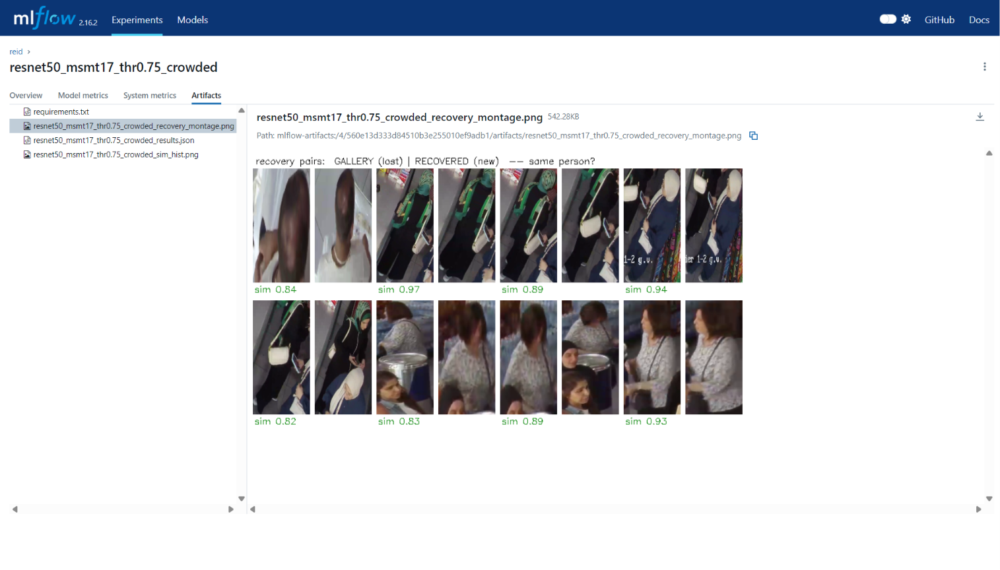
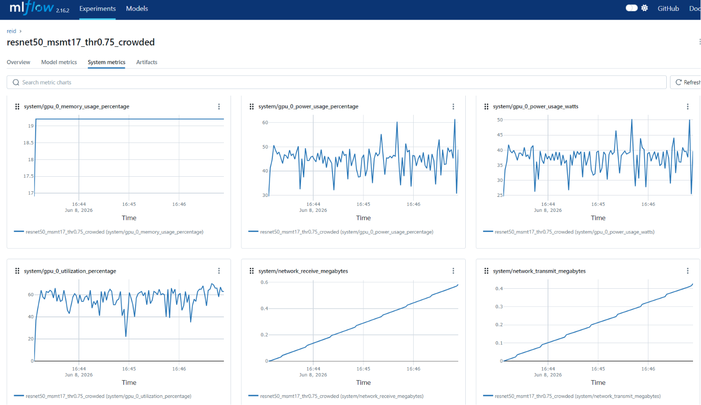
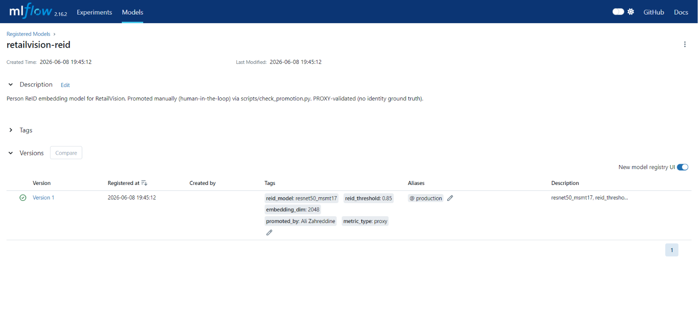

# ReID Experiment — MLflow Results & Model Decision

> From the MLflow `reid` experiment (7 runs, GPU/RTX 3070). Source of truth = the
> MLflow tracking server (`docker compose ... up -d mlflow` → http://localhost:5000 →
> experiment `reid`). Best run id (resnet50 @ thr0.75): `560e13d333d84510b3e255010ef9adb1`.
>
> ⚠️ **PROXY METRICS ONLY.** There is no per-person identity ground truth for the clip
> (we know 16 people total, not "who is who when"). So the *true* ReID-quality metrics
> (false-merge rate, validated match accuracy) **cannot be computed**. Everything below
> is computed from the recovery logic's *behavior* and compares models **relatively** —
> it does not certify recoveries are correct. See "Limitations".

## Experiment design

- **Detection + tracking FIXED** at the promoted configs (rtdetr-x conf0.5 + BoT-SORT),
  so every run sees identical tracks — only the ReID embedding/threshold varies.
- **Clip:** crowded only (`clip_cashier.mp4`, 16 people, 1810 frames) — need people who
  disappear and reappear for ReID to matter.
- **Recovery logic:** a disappeared track → lost pool (gallery + 150-frame TTL); a new
  track → recovered if cosine ≥ threshold, else a new identity is minted. (A lightweight
  re-implementation of the production `LocalIdentityManager` concept.)
- **Comparison (3 models @ thr 0.85):** osnet_x1_0_msmt17, osnet_x1_0_market1501,
  resnet50_msmt17. *(The untrained ImageNet `osnet_x1_0` baseline was excluded — boxmot
  has no ReID-trained weights for the bare name.)*
- **Threshold sweep (resnet50_msmt17):** 0.75 / 0.80 / 0.85 / 0.90.

**Metrics:** `unique_local_ids`, `count_error` (vs 16), `reid_match_rate`
(recoveries/attempts), `new_id_rate` (1−match_rate), `avg_recovery_similarity`,
`embedding_dim`, `avg_embed_ms`, `total_runtime_s`, plus auto-logged CPU/GPU/memory
system metrics. (`id_switches` dropped — it duplicated `reid_recoveries`.)

**All 7 runs:**



---

## 1. Model comparison (@ threshold 0.85)

| Model | count_error ↓ | match_rate ↑ | avg_recovery_sim | dim | avg_embed_ms ↓ |
|---|---|---|---|---|---|
| **resnet50_msmt17** | **18** ✅ | **0.60** ✅ | 0.93 | 2048 | **13** ⚡ |
| osnet_x1_0_market1501 | 20 | 0.57 | 0.94 | 512 | 26 |
| osnet_x1_0_msmt17 | 39 ❌ | 0.35 ❌ | 0.93 | 512 | 26 |



**Reading it:**
- **resnet50_msmt17 wins** — lowest count_error (18, closest to 16 people), highest
  recovery rate (0.60), and — notably — the **fastest** (13 ms/crop vs 26 for the OSNets;
  the 2048-dim ResNet uses the GPU more efficiently here). Confirms the deployed model.
- **osnet_x1_0_market1501 is a close 2nd** (0.57). Market-1501 (shopping-mall training
  data) generalises to this retail clip better than MSMT17 does for OSNet.
- **osnet_x1_0_msmt17 is clearly worst** (0.35, count_err 39) — under-recovers badly on
  this footage, *despite* `reid_experiments.md` Round 1 calling it the "current best."
  A real, documentable contradiction worth noting (different clip/conditions).

---

## 2. Threshold sweep (resnet50_msmt17) — the standout result

| reid_threshold | count_error ↓ | match_rate ↑ | avg_recovery_sim |
|---|---|---|---|
| **0.75** | **8** ✅ | **0.71** ✅ | 0.91 |
| 0.80 | 10 | 0.69 | 0.92 |
| 0.85 (current default) | 18 | 0.60 | 0.93 |
| 0.90 | 32 ❌ | 0.43 ❌ | 0.95 |



**Strong, monotonic effect that overturns the default.** Lowering the threshold sharply
improves recovery: at **0.75**, count_error falls to **8** (best — closest to 16 people)
and match_rate rises to **0.71**; at 0.90 it collapses (count_err 32, match_rate 0.43).
This directly answers `reid_experiments.md` "Problem R2 — threshold not validated":
**on this footage, 0.75 is meaningfully better than the production default of 0.85.**

`avg_recovery_similarity` stays high across all thresholds (0.91–0.95), meaning even the
extra recoveries at 0.75 are still high-confidence matches — reassuring, but see the
caveat below.

**Recovery evidence — similarity histogram + montage (resnet50 @ 0.75):**





The similarity histogram shows where recovery scores fall relative to the threshold; the
montage pairs each lost-identity crop with the crop it was matched to (visual spot-check
of whether recoveries are the same person — the only correctness check possible without
identity labels).

---

## 3. Time / space (resource cost)

System metrics (CPU/GPU/memory) are auto-logged per run; the GPU curves confirm runs
executed on the RTX 3070.



- **resnet50_msmt17:** 2048-dim embeddings, ~13 ms/crop, ~225 s/run. Faster per crop than
  the OSNets despite the bigger embedding (better GPU utilisation).
- **OSNet variants:** 512-dim (4× smaller embeddings — cheaper storage per identity),
  ~26 ms/crop, ~266 s/run.

---

## 4. Decision

| Dimension | Winner |
|---|---|
| Recovery quality (count_error, match_rate) | **resnet50_msmt17** |
| Speed (avg_embed_ms) | **resnet50_msmt17** (13 ms) |
| Embedding storage (smaller) | OSNet (512-dim vs 2048) |
| Best threshold (proxy) | **0.75** (count_err 8, match_rate 0.71) |

**Chosen model: `resnet50_msmt17`** — best recovery *and* fastest; matches the deployed
model (`services/reid_service`). **Threshold finding:** the data favours **0.75** over the
current **0.85** default — a genuine tuning insight to consider, subject to the proxy
caveat below.

### Limitations (state these in the report)
1. **Proxy metrics, no identity ground truth.** `count_error` / `match_rate` measure
   *behavior*, not *correctness*. A lower threshold recovers more — but without labels we
   cannot confirm the extra recoveries aren't false merges. So "0.75 is better" is
   **proxy-better**; validate with a labelled clip before changing production from 0.85.
2. **Recovery logic is a simplified re-implementation** of the production
   `LocalIdentityManager` (lost pool + gallery + cosine threshold) — faithful enough for
   *comparing* models, but absolute numbers won't equal production.
3. Counts inherit detection over-counting (RT-DETR duplicate boxes → extra tracks → extra
   identities). The cross-model **comparison** is valid; treat absolute counts as relative.

---

## 5. Model registry — promoted to Production

The winning model is registered in the MLflow Model Registry as `retailvision-reid`
**v1, stage = Production** (alias `@production`), promoted by the human-in-the-loop step
after the (PROXY) gate passed (`count_error` 18 ≤ 18 · `reid_match_rate` 0.60 ≥ 0.55).
Production is `resnet50_msmt17` @ `reid_threshold=0.85` — the conservative choice; the
0.75 threshold finding is documented above as proxy-better, to validate on a labelled clip
before changing production. See the gate + promotion lifecycle in
[MLOPS_PIPELINE](../../MLOPS_PIPELINE.md).



---

## 6. Reproduce / view

```bash
docker compose -f docker-compose.yml -f docker-compose.dev.yml up -d postgres minio mlflow
# http://localhost:5000 -> experiment "reid"

docker compose -f docker-compose.yml -f docker-compose.dev.yml -f docker-compose.gpu.yml \
  --profile mlops run --rm mlops python mlops/eval/run_reid_eval.py
```

Per-run artifacts (MLflow + `mlops/outputs/`): `*_sim_hist.png` (recovery-similarity
distribution + threshold line), `*_recovery_montage.png` (gallery-vs-recovered crop
pairs), `results.json`.
