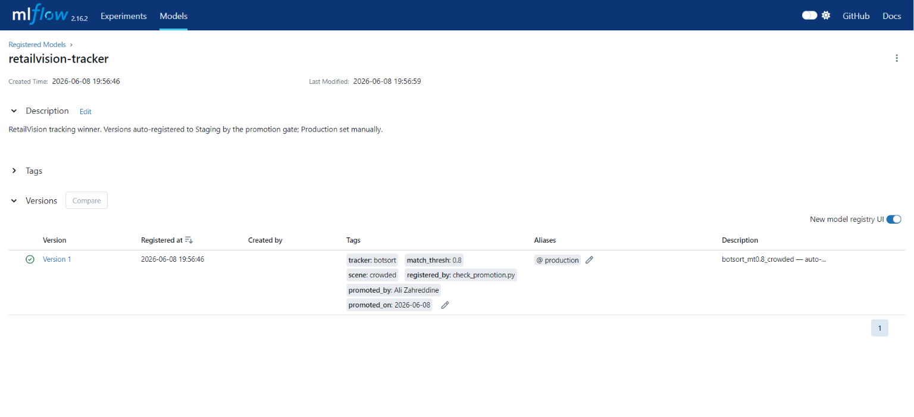

# Tracking Experiment — MLflow Results & Tracker Decision

> Auto-generated from the MLflow `tracking` experiment (7 runs, GPU/RTX 3070).
> Source of truth = the MLflow tracking server (`docker compose ... up -d mlflow` →
> http://localhost:5000 → experiment `tracking`). Winning run id:
> `77881febe8fa437ca52605c5696a2722` (botsort, match_thresh 0.8, crowded).

## Experiment design

- **Detection FIXED** at the promoted detector: `rtdetr-x`, conf=0.5, imgsz=640. Every
  tracker therefore sees **identical detections** — any difference is purely the
  tracker's identity-stitching quality (the controlled condition this experiment needs).
- **Clip:** crowded only (`clip_cashier.mp4`, 16 people / peak 14, 1810 frames). Tracking
  quality is only meaningful where real people move/cross/occlude.
- **Comparison:** BoT-SORT, ByteTrack, OC-SORT, StrongSORT (each @ match_thresh 0.8).
- **Tuning:** BoT-SORT match_thresh ∈ {0.6, 0.8, 0.9}.

**Metrics** (drop_to_zero excluded — no signal on an always-occupied clip):
Tier 1 `unique_track_ids` / `id_switches` / `track_fragmentation` (÷16);
Tier 2 `peak_track_error` (vs 14) / `avg_track_lifetime`;
Tier 3 `per_frame_assoc_ms` / `throughput_fps` (tracker.update() only).

> **Note on absolute numbers:** these are higher than `tracking_experiments.md`
> (which used a 302-frame clip; this is 1810 frames at 3072×2048). The cross-tracker
> **ranking** is the valid output, and it matches the doc.

**All 7 runs in MLflow:**


---

## 1. Tracker comparison (all @ match_thresh 0.8, crowded)

| Tracker | unique_track_ids ↓ | id_switches ↓ | fragmentation ↓ | peak_track_error ↓ | assoc_ms ↓ | fps ↑ |
|---|---|---|---|---|---|---|
| **BoT-SORT** | **57** ✅ | 7 | **3.56** ✅ | 3 | 13.2 | 76 |
| OC-SORT | 65 | 14 | 4.06 | 2 | 2.3 ⚡ | 426 |
| ByteTrack | 82 | **5** ✅ | 5.12 | 2 | 2.0 ⚡ | 508 |
| StrongSORT | 83 | **64** ❌ | 5.19 | 2 | 150.1 ❌ | 7 |

**MLflow Compare — `id_switches` by tracker (StrongSORT is the outlier at 64):**


**Winning run (`botsort_mt0.8_crowded`) metrics:**


**Track-timeline (Gantt) — each track ID as a bar over its alive frames; the visual
behind the churn metrics (few long bars = stable, many short = churny):**


**Reading it:**
- **BoT-SORT wins the primary churn metrics:** lowest `unique_track_ids` (57) and lowest
  `track_fragmentation` (3.56) — fewest identity re-creations. This is the headline
  tracker-quality result and matches `tracking_experiments.md` (BoT-SORT best, then
  ByteTrack/OC-SORT, StrongSORT worst).
- **ByteTrack has the fewest `id_switches` (5)** but the *most* unique IDs (82) — it
  flips IDs less *within* a track yet creates many more tracks overall. On the primary
  churn metric (unique IDs) BoT-SORT still wins.
- **StrongSORT is clearly worst:** 64 id_switches (≈9× the others) and 150 ms/frame
  (≈20× slower — its appearance model). Decisively eliminated, as the doc predicted.
- **Speed is the inverse story:** ByteTrack (508 fps) and OC-SORT (426 fps) are ~5–6×
  faster than BoT-SORT (76 fps), because BoT-SORT runs camera-motion compensation
  (sparse optical flow) on the large 3072×2048 frames.

---

## 2. match_thresh sweep (BoT-SORT)

| match_thresh | unique_track_ids | id_switches | fragmentation |
|---|---|---|---|
| 0.6 | 61 | 6 | 3.81 |
| **0.8** | 57 | 7 | 3.56 |
| 0.9 | 57 | 7 | 3.56 |

**Effectively flat** — 0.8 and 0.9 are identical; 0.6 slightly worse. Confirms
`tracking_experiments.md`: with RT-DETR's clean detections, `match_thresh` has near-zero
effect on tracking quality. **0.8 is the right default** (`result=no_effect`).


---

## 3. Decision: **BoT-SORT, match_thresh = 0.8** ✅

| Dimension | Winner |
|---|---|
| Identity stability — unique_track_ids | **BoT-SORT** (57) |
| Fragmentation | **BoT-SORT** (3.56) |
| id_switches | ByteTrack (5), BoT-SORT 2nd (7) |
| Speed | ByteTrack (508 fps); BoT-SORT slowest (76 fps) |

**Chosen tracker: BoT-SORT @ match_thresh 0.8** — best identity continuity (lowest
unique IDs + fragmentation, low id_switches), consistent with the project's prior
`tracking_experiments.md` conclusion and with the production config in
`services/iep2_vision/tracker/tracker.py` (BoT-SORT, motion-only, defaults).

### Honest trade-off to note
BoT-SORT is **~5–6× slower** than ByteTrack/OC-SORT on this footage (76 vs 426–508 fps),
because of its optical-flow camera-motion compensation. For the current target (≤5 fps
per camera, tracker not the bottleneck — `tracking_experiments.md` CPU benchmark) this is
fine. **If edge throughput ever became the constraint, ByteTrack is the fallback** —
it's far faster and has the fewest id_switches, at the cost of more total track churn.

**Performance across trackers (`per_frame_assoc_ms` / `throughput_fps`):**


### Limitations
- Absolute counts are inflated vs. the old doc (longer/larger clip) and partly inherited
  from detection over-counting (RT-DETR's duplicate boxes → extra tracks). The
  **comparison** is valid; treat absolute `unique_track_ids` as relative, not ground truth.
- True per-person counting is resolved downstream by ReID de-duplication (IEP3), not the
  tracker.

---

## 4. Model registry — promoted to Production

The winning run is registered in the MLflow Model Registry as `retailvision-tracker`
**v1, stage = Production** (alias `@production`), promoted by the human-in-the-loop step
after the gate passed (`track_fragmentation` 3.56 ≤ 4.0 · `id_switches` 7 ≤ 12). See the
gate + promotion lifecycle in [MLOPS_PIPELINE](../../MLOPS_PIPELINE.md).



---

## 5. Reproduce / view

```bash
docker compose -f docker-compose.yml -f docker-compose.dev.yml up -d postgres minio mlflow
# http://localhost:5000 -> experiment "tracking"

docker compose -f docker-compose.yml -f docker-compose.dev.yml -f docker-compose.gpu.yml \
  --profile mlops run --rm mlops python mlops/eval/run_tracking_eval.py
```

Per-run artifacts (MLflow + `mlops/outputs/`): the **track-timeline (Gantt) plot**
(`*_track_timeline.png` — each track ID as a bar over its alive frames; the key visual
for churn), the peak frame, and `results.json`.
